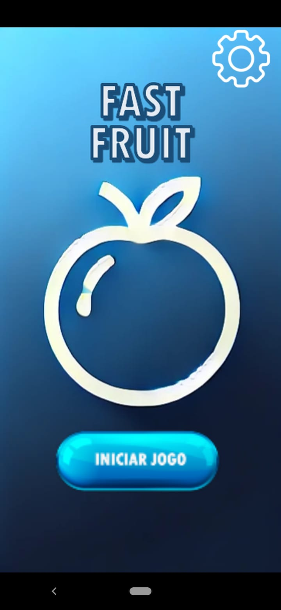
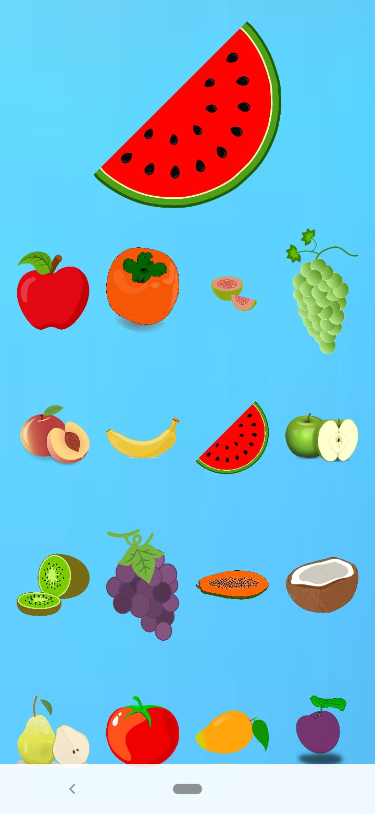
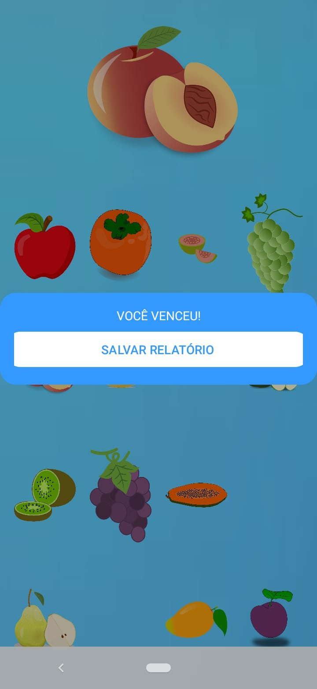

# FastFruit

Este é um aplicativo Android desenvolvido na faculdade utilizando Kotlin.
Ele é baseado no jogo de tabuleiro Tapa Certo e foi aplicado no formato de frutas e foi fabricado para jovens com autismo, oferecendo um relatório final com todos os dados de acertos e erros, etc.

## 🔧 Tecnologias

- Kotlin
- Android Studio

## 📸 Capturas de Tela

Abaixo estão algumas imagens da interface do aplicativo:

  
  
  

